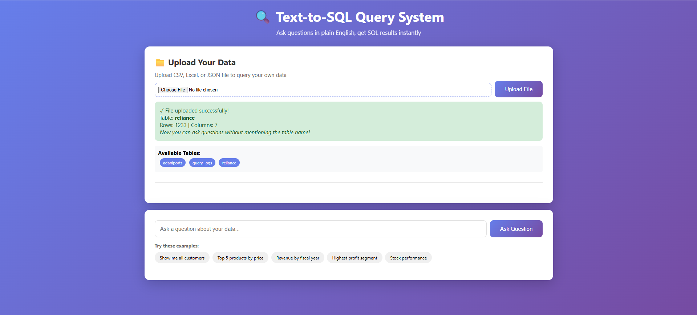

# 🔍 AI-Powered Text-to-SQL Query System

An intelligent system that converts natural language questions into SQL queries and executes them on your data. Upload any CSV/Excel file and start asking questions in plain English!

  

## ✨ Features

- 🤖 **AI-Powered SQL Generation** - Uses Groq LLM (Llama 3.3) to convert natural language to SQL
- 📁 **File Upload Support** - Upload CSV, Excel, or JSON files
- 🎯 **Smart Context Awareness** - Automatically queries your uploaded data
- 💻 **Beautiful Web Interface** - Modern, responsive UI
- ⚡ **Real-time Results** - Instant query execution and results
- 📊 **Query History** - Track all your queries
- 🐳 **Docker Containerized** - Easy deployment

## 🎥 Demo

[Live Demo Link] - *Coming Soon*

## 🖼️ Screenshots

### Upload Your Data


### Ask Questions in Natural Language


### Get Instant Results


## 🚀 Quick Start

### Prerequisites
- Docker & Docker Compose
- Groq API Key (Free at [console.groq.com](https://console.groq.com))

### Installation

1. **Clone the repository**
   ```bash
   git clone https://github.com/yourusername/text-to-sql.git
   cd text-to-sql
   ```

2. **Set up environment variables**
   ```bash
   # Create .env file
   echo "GROQ_API_KEY=your_groq_api_key_here" > .env
   ```

3. **Start the application**
   ```bash
   docker-compose -f docker-compose-simple.yml up -d
   ```

4. **Open the application**
   - Open `frontend.html` in your browser
   - Or visit `http://localhost:8000/docs` for API documentation

## 📖 Usage

### 1. Upload Your Data
- Click "Choose File" and select a CSV, Excel, or JSON file
- System automatically creates a table and loads your data

### 2. Ask Questions
Simply type questions in natural language:
- "Show me first 20 rows"
- "What is the highest value in the price column?"
- "Show me all records where sales > 1000"
- "What is the average revenue by month?"

### 3. Get Results
- See the generated SQL query
- View results in a formatted table
- Check execution time

## 🏗️ Architecture

```
┌─────────────┐      ┌──────────────┐      ┌─────────────┐
│   Frontend  │─────▶│   FastAPI    │─────▶│  PostgreSQL │
│   (HTML/JS) │      │   Backend    │      │  Database   │
└─────────────┘      └──────────────┘      └─────────────┘
                            │
                            ▼
                     ┌──────────────┐
                     │  Groq LLM    │
                     │  (Llama 3.3) │
                     └──────────────┘
```

## 🛠️ Tech Stack

- **Frontend**: HTML5, CSS3, Vanilla JavaScript
- **Backend**: FastAPI (Python)
- **Database**: PostgreSQL 15
- **AI/LLM**: Groq API (Llama 3.3-70B)
- **Data Processing**: Pandas, OpenPyXL
- **Containerization**: Docker, Docker Compose

## 📁 Project Structure

```
text_to_sql/
├── app/
│   ├── main.py              # FastAPI application
│   ├── database.py          # Database utilities
│   └── sql_validator.py     # SQL validation
├── init_db/
│   └── 01_init.sql          # Database initialization
├── frontend.html            # Web interface
├── docker-compose-simple.yml
├── Dockerfile.api
├── requirements.api.txt
└── README.md
```

## 🔧 Configuration

### Environment Variables
- `GROQ_API_KEY`: Your Groq API key (required)
- `DATABASE_URL`: PostgreSQL connection string (auto-configured)

## 📊 Example Queries

**Financial Data Analysis:**
- "What is the total revenue by year?"
- "Show me top 10 customers by sales"
- "Calculate average order value"

**Stock Market Data:**
- "What is the highest closing price?"
- "Show me dates where volume exceeded 50 million"
- "Calculate 7-day moving average of closing price"

**General Data:**
- "Show me records from last month"
- "What are the unique values in category column?"
- "Count records by status"

## 🚀 Deployment Options

### Option 1: Docker (Recommended)
```bash
docker-compose -f docker-compose-simple.yml up -d
```

### Option 2: Cloud Deployment
- **AWS**: Deploy on EC2 or ECS
- **Google Cloud**: Deploy on Cloud Run
- **Azure**: Deploy on Container Instances
- **Heroku**: Use Heroku Postgres + Container

### Option 3: Free Hosting
- **Render.com**: Free tier available
- **Railway.app**: Free tier with PostgreSQL
- **Fly.io**: Free tier for small apps

## 🤝 Contributing

Contributions are welcome! Please feel free to submit a Pull Request.

1. Fork the repository
2. Create your feature branch (`git checkout -b feature/AmazingFeature`)
3. Commit your changes (`git commit -m 'Add some AmazingFeature'`)
4. Push to the branch (`git push origin feature/AmazingFeature`)
5. Open a Pull Request

## 📝 License

This project is licensed under the MIT License - see the [LICENSE](LICENSE) file for details.

## 👤 Author

**Your Name**
- GitHub: [@yourusername](https://github.com/yourusername)
- LinkedIn: [Your LinkedIn](https://linkedin.com/in/yourprofile)
- Portfolio: [yourwebsite.com](https://yourwebsite.com)

## 🙏 Acknowledgments

- [Groq](https://groq.com) for providing fast LLM inference
- [FastAPI](https://fastapi.tiangolo.com/) for the amazing web framework
- [PostgreSQL](https://www.postgresql.org/) for the robust database

## 📧 Contact

For questions or feedback, please reach out:
- Email: your.email@example.com
- LinkedIn: [Your Profile](https://linkedin.com/in/yourprofile)

---

⭐ If you found this project helpful, please give it a star!

**Made with ❤️ and AI**
